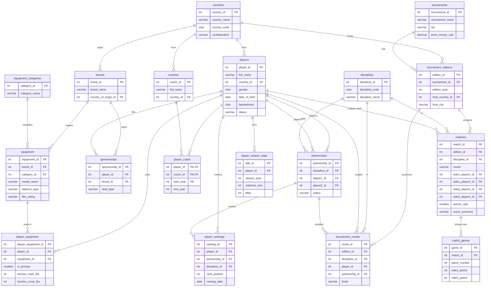

# BadmintonDB — A Professional Badminton Analytics Database

A relational SQL Server database modeling the elite professional badminton circuit —
players, equipment sponsorships, doubles partnerships, coaching histories, tournament
results, and match-by-match scorelines — paired with a library of analytical SQL
queries and a Tableau dashboard layer.

The project was built to answer questions a badminton **equipment manufacturer**
(Yonex, Victor, ASICS, Li-Ning) would actually care about: *Does racket brand correlate
with on-court performance? What string tensions do winners use? Which markets and
disciplines does each brand dominate?*

> **Tech stack:** Microsoft SQL Server · T-SQL · Python (ETL) · Tableau Public

- **Live dashboards:** _[add your Tableau Public link here]_
- **Source data:** BWF World Tour match data (Kaggle) + verified public tournament/ranking results

---

## What this project demonstrates

- **Relational schema design** — an 18-table normalized model with proper primary/foreign
  keys, junction tables for many-to-many relationships, and a single-table design that
  handles both singles and doubles cleanly.
- **Analytical SQL** — 20+ queries progressing from foundational JOIN/GROUP BY work up
  through CTEs, window functions (`LAG`, `RANK`), conditional aggregation, and `HAVING`.
- **ETL** — a Python pipeline that inspects, stages, and loads raw Kaggle CSVs into the
  production schema with de-duplication.
- **Data visualization** — Tableau dashboards built on top of the query outputs.
- **Data integrity discipline** — every seeded row is tagged `[REAL]` (verified from public
  sources) or `[REPRESENTATIVE]` (plausible illustrative values), so the database is never
  silently presenting invented data as fact.

---

## Schema

The database is organized around four subject areas: **people** (players, coaches,
partnerships), **equipment** (brands, products, sponsorships, what's actually in the bag),
**competition** (tournaments, editions, results, matches, games), and **reference**
(countries, disciplines, categories).



### Design notes

- **One `matches` table for singles and doubles.** A match has four player slots
  (`side1_player1`, `side1_player2`, `side2_player1`, `side2_player2`). Singles matches
  simply leave the `_player2` slots `NULL`. This avoids duplicate tables but means win-rate
  queries have to "unfold" all four slots to find every match a player appeared in — see
  the query catalog below.
- **Singles vs. doubles results share one table.** `tournament_results` uses `player_id`
  for singles and `partnership_id` for doubles; the unused column is `NULL`. The same
  pattern is used in `player_rankings`.
- **Player-specific string tension** is stored on `player_equipment` as a main/cross split
  (`tension_main_lbs` / `tension_cross_lbs`), since elite players string the two axes at
  different tensions. This is the dataset's most distinctive feature and powers the
  tension-vs-performance analysis.

---

## Analytical query catalog

The queries are organized into three tiers of increasing SQL sophistication.

### Tier 1 — Foundational (JOIN, GROUP BY, conditional aggregation)

| Query | Question it answers | Techniques |
|---|---|---|
| Brand sponsorship footprint | How many players does each brand sponsor, split by gender? | `LEFT JOIN`, `COUNT`, `GROUP BY` |
| Paris 2024 medal table | Gold / silver / bronze count by country | multi-`JOIN`, `CASE`, `GROUP BY` |
| Roster by country | Player count per country, men vs. women | conditional `COUNT` with `CASE` |

### Tier 2 — Intermediate (multi-join, CTEs, subqueries)

| Query | Question it answers | Techniques |
|---|---|---|
| Brand vs. performance | Average win rate grouped by each player's primary racket brand | 4-way `JOIN`, `is_primary` filter, ratio aggregation |
| Tension profiles | Average string tension by brand and gender | `AVG`, `COALESCE` (for main/cross split), `CASE` |
| Win rate from raw matches | Each player's win % computed directly from `matches` | the **four-slot unfold** via `UNION ALL` |
| Head-to-head | Match list + W–L summary between two players | CTE, self-referential slot logic |
| Matches per edition | Match volume per tournament edition | `JOIN`, `COUNT`, `GROUP BY` |

### Tier 3 — Advanced (window functions, HAVING, multi-source rollups)

| Query | Question it answers | Techniques |
|---|---|---|
| Win rate per season | Year-over-year win-rate change per player | `LAG() OVER (PARTITION BY ... ORDER BY ...)` |
| National pecking order | Rank players within their country by total wins | `RANK() OVER (PARTITION BY ...)` |
| Doubles dominance | Rank doubles pairs by titles, per discipline | partnership joins, conditional `SUM` |
| Tension vs. win rate | Each player's avg tension next to their win rate | correlated aggregation across `player_equipment` + `matches` |
| Country dominance by discipline | Titles per country in each of the five disciplines | `COALESCE` across singles/doubles, `GROUP BY` |
| Racket model performance | Users and combined win rate per racket model | `COUNT(DISTINCT ...)`, ratio aggregation |
| Multi-title seasons | Any player/pair winning 3+ titles in one year | `HAVING COUNT(...) >= 3` |
| Coach impact | Titles won by players under each coach | many-to-many coach joins, `COUNT(DISTINCT ...)` |

---

## How to run it

1. Open **SQL Server Management Studio (SSMS)** and connect to your SQL Server instance.
2. Open and run `BadmintonDDL_DML.sql` on a fresh connection. It will:
   - create the `BadmintonDB` database,
   - build all 18 tables (dropping any existing copies in dependency order first), and
   - load the seed data.
3. Open `SQL_Badminton_Queries.sql` and run any query against the new database.

> **Requires SQL Server 2016 or later** (the build script uses `DROP TABLE IF EXISTS`).

### Optional: bulk-loading the Kaggle match data

The hand-curated seed gives you a working database immediately. To load the full BWF
World Tour match history, the Python ETL (`/etl`) runs in three steps:

1. `01_inspect.py` — prints the columns and row counts of each raw CSV (never touches the DB).
2. `02_load_staging.py` — loads each discipline's CSV into a staging table.
3. `03_transform.py` — de-duplicates players and inserts matches into the production schema.

---

## Data sourcing & integrity

Every seeded row carries a provenance tag in the SQL comments:

- **`[REAL]`** — verified from public sources: BWF world rankings (~April 2026), published
  sponsorship announcements, and confirmed Olympic / World Championships / All England
  results.
- **`[REPRESENTATIVE]`** — plausible illustrative values used where public data is sparse
  (some doubles players' biographical details, non-final scorelines, season win/loss totals).
  These are clearly labeled and are **not** presented as factual claims.

This tagging keeps the database honest: anyone reviewing it can tell at a glance which
figures are sourced and which are illustrative.

---

## Repository structure

```
.
├── README.md
├── BadmintonDDL_DML.sql        # schema + seed data (run this first)
├── SQL_Badminton_Queries.sql   # analytical query library
└── etl/                        # optional Python bulk-load pipeline
    ├── 01_inspect.py
    ├── 02_load_staging.py
    └── 03_transform.py
```
